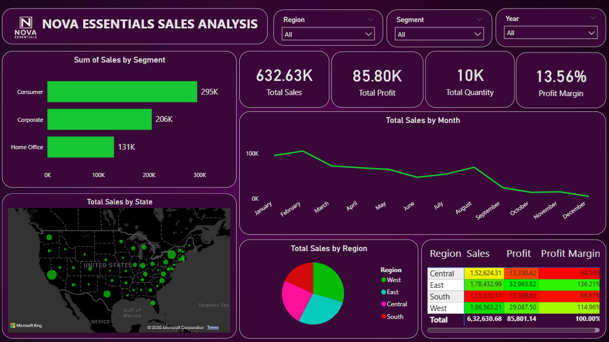

# 📊 Nova Essentials Sales Analysis

## 🔍 Project Overview

This Power BI project analyzes the sales performance of **Nova Essentials**, providing comprehensive insights into revenue, profit, customer behavior, product performance, and regional trends. The dashboard enables data-driven decision-making for key stakeholders across marketing, operations, and product teams.

---

## 📁 Project Files

| File Name                             | Description                      |
|--------------------------------------|----------------------------------|
| `Nova Essentials Sales Analysis.pbix`| Power BI report file             |
| `dashboard.png`                      | Screenshot of main dashboard     |
| `report.png`                         | Screenshot of detailed report    |

---

## 📈 Key KPIs

| Metric              | Value     |
|---------------------|-----------|
| **Total Sales**     | 632.63K   |
| **Total Profit**    | 85.80K    |
| **Total Quantity**  | 10K units |
| **Profit Margin**   | 13.56%    |

---

## 📊 Dashboard Insights

### 📌 Sales by Segment
- **Consumer** leads with 295K in sales
- Followed by **Corporate** (206K) and **Home Office** (131K)

### 🗺️ Sales by Region & State
- **West** region dominates in total revenue
- Geographic clustering shows high performance in coastal and southern states

### 📆 Sales Trend by Month
- Sales peak in **Jan–March**
- Gradual decline observed from **September through December**

### 💡 Sub-Category Profitability

| Sub-Category | Sales     | Profit    | Profit Margin |
|--------------|-----------|-----------|----------------|
| Accessories  | 49K       | 13.1K     | 198.14%        |
| Art          | 8.8K      | 1.9K      | 159.99%        |
| Appliances   | 27.7K     | 2.3K      | 62.88%         |
| Chairs       | 90.9K     | 9.9K      | 80.91%         |
| Bookcases    | 31.0K     | -878.11   | **-0.82%**     |
| Binders      | 42.9K     | 4.7K      | 80.17%         |

---

## 📄 Sales Dashboard Insights

  

---

## 📄 Sales Report Insights

  

### 💼 Top Performing Products by Profit Margin
- Canon imageCLASS 2200 Copier → **353.91%**
- HP LaserJet 3310 Copier → **286.25%**
- HP T520 Inkjet Printer → **235.94%**

### ❌ Loss-Making Products
- Tables → -47.65%
- Supplies → -62.79%
- Ativa Shredder → -367.93%

### 👤 Customer Profitability
- Some customers like *Caroline Jumper* and *Daniel Raglin* contribute positively
- Others like *Karen Ferguson* and *Maria Etzadi* result in large losses (margins < -100%)

---

## ⚠️ Business Problems Identified

| Problem                                  | Insight                                                        |
|------------------------------------------|----------------------------------------------------------------|
| **Declining Sales Trend**                | Sales drop significantly from September onward                |
| **Unprofitable Products**                | Tables and Storage generate consistent losses                 |
| **Inefficient Customer Segments**        | Some high-volume customers are not profitable                 |
| **Underutilized High-Profit Products**   | Accessories and Copiers have high margins but low volume      |
| **Regional Sales Gap**                   | West is dominant; East and Central underperform               |

---

## ✅ Recommendations

- 📦 Discontinue or optimize unprofitable SKUs like *Tables* and *Supplies*
- 📊 Launch seasonal campaigns in Q4 to counter the sales drop
- 🧑‍💼 Segment customers by profitability and optimize pricing/discounts
- 🌍 Focus marketing on underperforming regions (East & Central)
- 🚀 Promote high-margin, low-volume products to increase profitability

---

## 🛠 Tools Used

- **Power BI** (DAX, Power Query)
- **Excel** for initial data shaping
- Visualizations: Bar Charts, Maps, Line Graphs, Pie Charts, Tables, Matrices

---

## 📌 How to Use

1. Download the `.pbix` file
2. Open with **Power BI Desktop**
3. Navigate between:
   - **Sales Performance Dashboard**
   - **Sales Report**
4. Use slicers to filter by Region, Segment, and Year

---

## 📧 Contact

For any feedback or collaboration opportunities:  
**Author**: Sarthak Salvi  
**Email**: [sarthaksalvi2107@gmail.com](mailto:sarthaksalvi2107@gmail.com)

---

> ⭐ If you found this project insightful, consider starring this repository!
